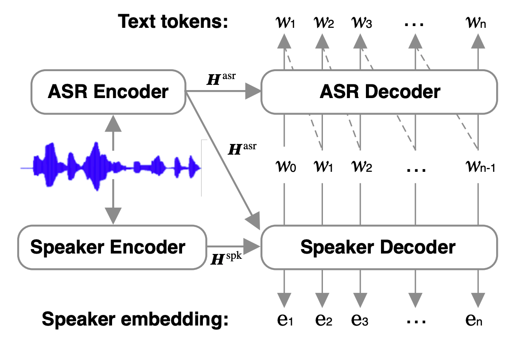

# MSA-ASR
Multilingual Speaker-Attributed Automatic Speech Recognition

### Introduction

This repository provides an implementation of a Speaker-Attributed Automatic Speech Recognition model. The model performs both multilingual speech recognition and speaker embedding extraction, enabling speaker differentiation.

Model architecture




### Setup

```
git clone git@github.com:nguyenvulebinh/MSA-ASR.git
cd MSA-ASR
conda create -n MSA-ASR python=3.10
conda activate MSA-ASR
pip install -r requirements.txt
```

Test script:

```
python infer.py
```

### Citation

```bibtex
@misc{nguyen2025msaasrefficientmultilingualspeaker,
      title={MSA-ASR: Efficient Multilingual Speaker Attribution with frozen ASR Models}, 
      author={Thai-Binh Nguyen and Alexander Waibel},
      year={2025},
      eprint={2411.18152},
      archivePrefix={arXiv},
      primaryClass={cs.CL},
      url={https://arxiv.org/abs/2411.18152}, 
}
```

### License

CC-BY-NC 4.0

### Contact

Contributions are welcome; feel free to create a PR or email me:

```
[Binh Nguyen](nguyenvulebinh[at]gmail.com)
```